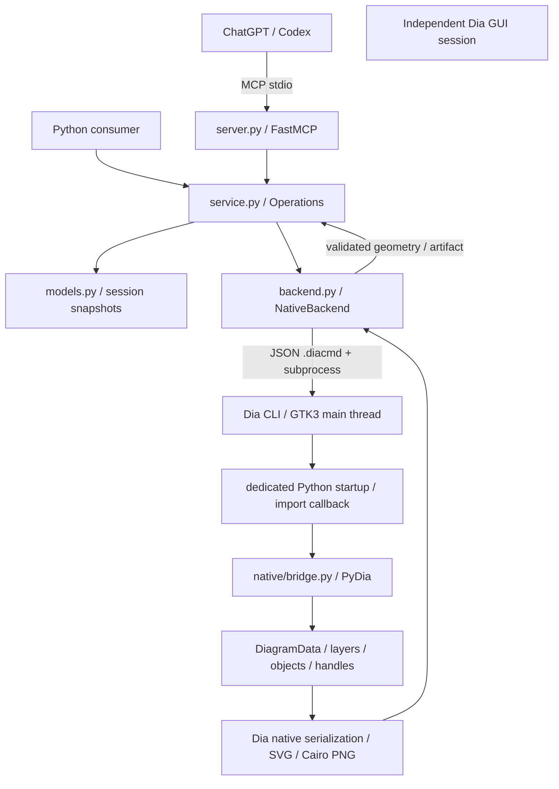
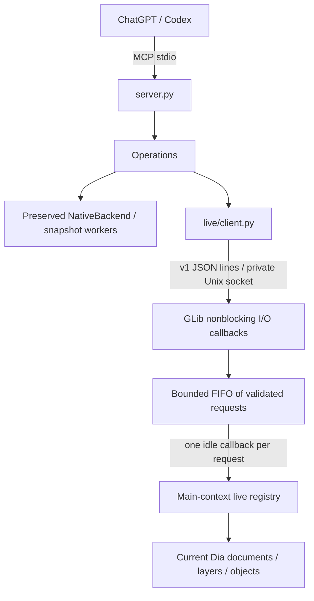

# Dia MCP architecture

Audit date: 2026-09-19. Repository baseline: `77fe10bc0`; upstream base:
`ad68cc378b7a187706bc2648c48b44d16fb80819`. Source code is authoritative.
M1–M7 are implemented. The original roadmap below is retained as design context;
[M3–M7 implementation and acceptance](m3-m7-validation.md) is the current write contract.
See [capability inventory](mcp-capabilities.md), [tool contract](mcp-tools.md),
[development](mcp-development.md), [progress](progress.md) and
[upstream differences](upstream-differences.md).

## Preserved snapshot architecture

This snapshot path does not connect to an open GUI document. `Operations` owns an in-memory
Pydantic document; each edit clones it, validates it, and reconstructs the entire
diagram in a fresh Dia subprocess. A temporary native `.dia` export and a JSON
geometry report must succeed before revision/state are replaced. This is native
model manipulation through PyDia, not writing Dia XML by hand, IPC with a running
editor, a Python package imported into the server, or mouse automation.

The nine initial MCP tools create, inspect, connect, move, update, export and
close session diagrams. They expose 13 allowlisted node types and four connectors.
`get_capabilities` describes this contract statically; it does not probe the
installation. These snapshot tools remain intentionally restricted. The separate live interface now
adds native editing/history/files/layout, resources and a context prompt; group/layer
mutation remains outside its exposed command set. See the current M3–M7 contract.

### Upstream model and existing integration surface

| Concept | Repository evidence | Consequence for integration |
| --- | --- | --- |
| Build and GUI | `meson.build`, `app/main.c`, `app/app_procs.c` | Dia 0.98.0, GTK3, Meson, C/C++; keep the existing build and dependency locks. GTK4 is a separate plan. |
| Documents | `lib/diagramdata.h`, `app/diagram.c`, `app/dia-application.c` | `DiagramData` owns ordered layers, bounds, paper, selection and text focus; editor `Diagram` adds displays, modified state and history. An importer receives only model data. |
| Object families | `lib/object.h`, `lib/object.c`, `objects/meson.build` | Registered factories and object operations supply creation, serialization, geometry and properties. Compiled object families coexist with XML custom shapes and lines. |
| Geometry | `lib/geometry.h`, `lib/handle.h`, `lib/connectionpoint.h` | Document coordinates: x right, y down, default cm. Bounds, handles and connection points are separate concepts; GUI zoom and display scaling are irrelevant. Paper scale affects export, not requested coordinates. |
| Properties | `lib/properties.h`, `plug-ins/python/pydia-properties.c`, `pydia-property.c` | Descriptors and typed value conversion exist. PyDia exposes name/type/value/visibility/description/tooltip, but not a complete safe read/write schema or enum constraints. Visibility does not imply writability. |
| Connections | `lib/object.h`, `plug-ins/python/pydia-handle.c`, `app/load_save.c` | Handles attach to connection points; native serialization stores object references and point indices. A visual line is not automatically connected. |
| Selection/layers | `pydia-diagram.c`, `pydia-layer.c`, `pydia-diagramdata.c` | Existing wrappers expose selected objects, grouping and layer operations. They need lifetime, history and main-thread policies before remote use. |
| Undo | `app/undo.c`, `app/undo.h` | Native change stack and transaction points exist. PyDia `Object.move` discards its returned change; property setters call `dia_object_set_properties`. These calls do not automatically implement editor undo. |
| Serialization/export | `app/load_save.c`, `lib/filter.c`, renderer plug-ins | Native `.dia`, SVG and Cairo PNG are reused by MCP; the editor supports additional installed import/export filters. |
| Layout | `app/commands.c`, `app/object_ops.c`, `plug-ins/layout` | Alignment and distribution already exist. OGDF-related source is not proof of a built or available layout capability. Probe before advertising algorithms. |

### Sheets, shapes and runtime discovery

`app_init` registers plugins and built-in types, loads sheets, loads defaults,
then processes CLI imports. The embedded startup script runs while plugins are
loading: **query sheets in an import callback, not at startup-module import**.
`dia.registered_types()` and `dia.registered_sheets()` already exist upstream in
`plug-ins/python/diamodule.c`; no C discovery API needs to be invented.

`lib/sheet.c::load_all_sheets` loads user sheets and either `DIA_SHEET_PATH`
(colon-separated directories) or installed system sheets. Names are kept in the
C locale, descriptions are localized. User/system shadowing is resolved by Dia;
missing types are warned about and omitted from the sheet. The absence of an
entry from runtime discovery cannot prove that no broken source sheet exists.
`objects/custom/custom.c` recursively loads user shapes and `DIA_SHAPE_PATH` or
the installed shape directory. Environment paths replace the corresponding
system search path; include the installed directory when extending it.

A sheet is a palette, not an exclusive diagram classification. The same factory
can appear more than once, with different labels or creation data; registered
types may not occur in any sheet. `pydia-sheet.c` returns type/description/icon
triples but omits sheet-entry creation data. Do not equate a count of sheet
entries, unique factory types, or implemented semantic operations.

The existing image returned 38 sheets, 887 registered types and 891 sheet entries
under its own installation/configuration. The source contains 38 `.sheet` and
783 `.shape` files. These are a dated observation, not constants for clients.
A container's inventory does not describe the user's independently running GUI
or its custom sheets. The complete capture and membership table accompany this
audit in [mcp-capabilities.md](mcp-capabilities.md).

### Identity, transactions and concurrency

- UUID hex IDs belong to an `Operations` session and document. Object IDs survive
  movement/update and are stored as `meta.dia_mcp_id` in exported native files.
  Closing the document invalidates references. No reload/import, deletion,
  duplication, undo/redo or cross-session recovery contract exists yet. XML IDs
  such as `O0` are independent; no native pointer is sent to the client.
- `_commit` changes the logical state only after successful native rendering.
  Failure preserves the previous snapshot/revision. This is a service transaction,
  **not a Dia GUI undo transaction**; multi-call batches are not atomic.
- An `RLock` serializes service state within one server. FastMCP may invoke sync
  tools from worker threads; those threads only manipulate Python state and wait
  for a subprocess. PyDia objects exist exclusively in the CLI process and are
  used by its import callback on the main thread. There is no background mutation
  of the user's GUI. The lock does not serialize separate servers.
- Every edit recreates all nodes, labels and connectors. Full document/geometry
  responses amplify this cost. Current limits are 32 documents, 100 nodes and
  200 edges per document; these are MCP limits, not Dia limits.

### Error, security and file boundary

`DiaError` produces `{api_version, code, message}` through MCP `ToolError`;
SDK schema validation may reject arguments first. Codes currently include
`INVALID_ARGUMENT`, `NOT_FOUND`, `LIMIT_EXCEEDED`, `EMPTY_DIAGRAM`,
`ALREADY_EXISTS`, `BACKEND_UNAVAILABLE`, `BACKEND_TIMEOUT`, `BACKEND_FAILED`,
`EXPORT_FAILED` and `IO_ERROR`. The discovery increment also returns
`UNSUPPORTED_CAPABILITY` for backends without discovery. Alternative values, retryability and detailed
stale-reference errors are not yet modeled.

Local stdio exposes no shell, code evaluation or client-selected plugin path.
A trusted executable and dedicated startup directory are chosen by the server;
the embedded interpreter drops Python virtualenv path variables. Native plugins,
custom shapes, inherited Dia search paths and the configured installation remain
trusted application inputs, not an OS sandbox. Docker tasks additionally disable
networking and run as the invoking UID. Snapshot input is constrained; native
factories can still fail/crash, isolated to the subprocess with a timeout.

Export accepts a basename in one configured workspace, validates the generated
artifact, and publishes with `link` (no overwrite) or `replace` (explicit overwrite).
Preexisting symlinks are rejected. Workspace directory ownership is trusted;
it is not a defense against another process replacing that directory itself.
Do not confuse export, session close, Save, Save As and opening a user's document:
only export and session close exist today. Native-file dependency reporting is
therefore also missing. Logs use stderr; routine per-request tracing/correlation
is limited, and exception messages can contain input values. Avoid logging whole
documents when adding observability.

### Semantic coupling and implementation coupling

Desired coupling already exists in type names, properties, handles, connection
points and native export. Fragile coupling is mostly isolated in
`native/bridge.py`, but it is also visible in the public model/service:

1. `Node.properties` and tool signatures accept only `UMLClassProperties`;
   `Node.applicable_properties` rejects properties for every other family.
2. `Edge.applicable_label` restricts labels to UML; `connect_objects` assumes
   all UML connectors require two classes and special-cases indices >=8.
3. `Operations.capabilities` has a generic top-level `uml_direction` field.
4. `configure_node` knows the positional tuple layouts of UML attributes,
   methods and parameters; its fallback assumes technical shape flip/size fields.
5. Every node is assumed to have connection points; every connector factory is
   assumed to supply two endpoint handles. These are not generic Dia guarantees.
6. The default is a flowchart box; the architecture is not exclusively UML, but
   the property contract cannot represent unfamiliar families or arbitrary `.dia`.

Simply changing `NodeType` from an enum to a string would bypass these assumptions
and is unsafe. Domain tuple conversion belongs behind the integration adapter;
the generic model needs a typed property schema and optional geometry operations.

## Implemented M2 live read boundary

The normal installed `mcp-live.py` plugin does nothing unless `DIA_MCP_LIVE=1`.
It imports the stdlib-only `dia_mcp.live` package and PyGObject, then defers startup
until the GTK loop, after plugins/shapes/sheets have loaded. FastMCP stays outside
Dia. The dedicated snapshot Python startup is unchanged and never enables live IPC.
`Operations.inspect_live` delegates to `LiveClient`; MCP handlers manage neither
sockets nor native wrappers. The nine `live_*` tools cannot modify documents.

### Lifecycle assumptions revalidated against source

- `dia_open_diagrams` is populated in `dia_diagram_init`; `DiaApplication` also
  maintains its GUI list and add/remove/change signals. M2 resolves a fresh
  `dia.diagrams()` list and includes only documents with displays. A new/opened
  GUI document is visible on the next read; headless data is excluded.
- `dia.active_display().diagram` identifies the active document; multiple displays
  can share one document. No active display returns null.
- Closing the last display removes/destroys the diagram. The registry retains no
  wrappers, so it cannot extend document life or dereference a closed object.
- `diagram_load_into` can reuse the initial empty diagram. Its live document token
  is reset **before** import, even on failure, since an importer may change data
  before failing. Native object ownership is not inferred from filenames.
- `DiagramData` owns layers and selections; layers own object lists. Ordinary
  `PyDiaObject` wrappers have no ownership protection. Diagram/layer wrappers
  reference GObjects, but keeping them would alter lifetime. Every wrapper in M2
  is local to one main-context dispatch and is discarded before returning bytes.
- Existing object add/remove and selection signals are incomplete as a monotonic
  revision API. M2 adds conservative invalidation, not native write transactions.
- GLib I/O watches, idle callbacks and a periodic expiry callback suffice; no new
  receiver threads or custom thread synchronization are needed.

### Protocol, limits and dispatch

Wire protocol **1** uses one UTF-8 JSON object per line. Every connection starts
with `{"protocol_version":1,"action":"handshake"}`. Subsequent requests name an
allowlisted read action and its explicit fields. Unknown fields/actions, invalid
IDs/pagination and incompatible versions fail before model access. Responses have
`protocol_version` and exactly a result or structured error. Handshake returns
`integration_api_version=1`, actual `dia_version`, process `session_id`, read
capabilities, limits, identity and generation semantics. These versions are
independent of snapshot `api_version="1"`, the MCP package and native plugin ABI.
No commit hash is a compatibility contract.

Defaults (`live.protocol.Limits`, configurable by the embedding caller): 16 KiB
requests, 1 MiB responses, 16 queued requests, 32 clients, 100 items/page, 32
properties, 256 handles/points/fanout entries, 10,000 traversed objects, nesting
32, timeout 5 seconds. Timeouts may be configured up to 30 seconds. The MCP
`--timeout` is capped to 30 for its live client; it does not reconfigure the GUI.
Property/name text is capped at 2,048 characters. Oversized responses return
`LIVE_LIMIT_EXCEEDED`; pagination uses offset/limit/total/next_offset like M1.

I/O callbacks only receive, validate, queue and transmit serializable messages.
A separate GLib idle callback executes one FIFO request, verifies main-thread
identity, resolves native state, creates a plain result and bounds JSON output.
Nothing native reaches an external process or receiver callback. There are no
thread locks; the only lock is a nonblocking process-lifetime endpoint file lock.
No callback waits for a client or holds a lock while waiting for GTK.

One request may be outstanding per connection; pipelining is rejected. The client
performs handshake on each fresh connection and then its read, so reconnects do
not retain stale transport state. Disconnect removes queued work; expired queued
requests never run. An executing native getter cannot be preempted: it finishes
on the main thread, and an overdue result becomes a timeout. No read changes a
document. The 100 ms expiry timer closes stalled readers/writers. Queue saturation
returns `LIVE_QUEUE_FULL`; excess connections are closed. Shutdown closes clients,
discards queued work and removes the owned socket. Confirmed application exit
emits a new native shutdown notification, exposed as `dia.register_shutdown`;
Python `atexit` alone is insufficient because normal Dia exit does not finalize
its embedded interpreter. Crashes may leave a stale socket, recovered only under
the endpoint lock after verifying owner, socket type and absence of a listener.

### Identity, generations and read scope

Document IDs are process-session UUID + document UUID; object IDs add a native
runtime UUID scoped by that document. No address, wrapper identity or persisted
metadata is exposed. Lazy native object token storage is cleared on initialization,
copy, destruction and detach (including group descendants and layer removal).
Movement and property changes preserve tokens. Duplication gets a distinct token.
Delete/Undo/Redo restoration gets a **new** reference, deliberately: M2 promises
safe invalidation, not persistent identity through history. No unbounded remote
reference tombstone list is maintained. Unknown and expired references in the
current session therefore share stale-reference errors; other sessions/snapshot
IDs return `WRONG_SESSION`, and another document's object returns `OBJECT_NOT_FOUND`.
Layer UUIDs are GObject lifetime tokens, scoped by document; they are returned in
ordered paginated lists, not a separate layer getter.

Each document has a native invalidation counter, advanced on editor update-all,
region updates and explicit modified-state calls. The registry also observes
filename, modified status, ordered layer identity/name/visibility, active layer
and selection. A changed stamp increments the returned monotonic generation.
Multiple events between reads can coalesce; redraw-only events can advance it.
This is an **observed conservative editor generation**, separate from snapshot
revision, not an exact edit count. Arbitrary trusted plugin mutations that bypass
editor notifications are outside this guarantee. M3 fences commands against this
stamp on the same GTK context; conservative false conflicts are safe. Native
command commit/history also trigger editor invalidation.

Object lookup enumerates current membership and group members (bounded traversal),
then serializes only the requested object or page. It does not serialize a whole
document for a single read. Membership resolution remains O(N), and PyDia layer
getters allocate native membership tuples before the traversal limit is checked;
this is a documented scaling limit, not a constant-time registry. Large-document
indexing and cancellable native getters remain future work. Offsets can shift
between requests while the user edits; compare returned generations and restart
pagination on change. There is no cross-request read transaction.

Generic inspection exposes native type, document-space bounds/position, layer,
selection, parenting/group membership, handle/point counts, and all known runtime
sheet memberships up to the structural limit. Sheet metadata uses the same PyDia
sources as M1, cached for this GUI session after startup. Restart after changing
installed sheets; no live plugin-loading API is exposed. A type may have several
or no sheets. Mixed/custom types are independent of the snapshot creation allowlist.
Handles expose actual `connected_to` target and point index; points expose actual
connected objects, directions and flags. Visual proximity is never a connection.

Opt-in property detail reads scalar bool/int/enum/real/string and text values.
A bounded native descriptor-only accessor runs before ordinary PyDia property
lookup (which would already fetch the value). Other descriptors are returned
with `supported=false` without evaluating values;
images, file-backed and aggregate getters are excluded. No generic setters,
factory instantiation or inference of writability from visibility is implemented.

### Security boundary

The socket is `$XDG_RUNTIME_DIR/dia-mcp/live-<pid>.sock`: runtime and endpoint
directories must be owned by the user and private; symlink directory components
are rejected. Endpoint mode is 0600, directory mode 0700, and Linux `SO_PEERCRED`
rejects other UIDs. A separate private lock inode prevents concurrent replacement;
it is intentionally retained after shutdown to avoid lock-inode races. Only an
owned stale socket is removed, never an ordinary file, symlink or active listener.
The MCP client must be explicitly configured with the GUI socket path.

There is no TCP listener, request-supplied environment, Python evaluation, shell
execution, native address dispatch or plugin loading. Same-user installed plugins,
shapes and factories retain Dia's existing trust: this is not an OS sandbox, and
a faulty native getter can still crash the GUI. The snapshot backend retains its
separate crash-isolated worker path.

## Implemented M3–M7 native write boundary

The [current contract](m3-m7-validation.md) documents native transaction staging,
rollback, GUI history, scalar descriptors/editing, files, semantic helpers and
layout/context surfaces. Native changes are staged synchronously and transferred
to the original history on success; there is no second persistent history. Live
user documents are never rebuilt using the restricted snapshot model.

### Versions and completed M1 discovery

Existing document `api_version="1"` is the snapshot contract, not a stable native
ABI. Package metadata and `__init__.__version__` are both 0.2.0. Dia's own version and plugin ABI are separate. The live
handshake must advertise its integration API version and actual capabilities,
without pinning clients to a commit or versioning every semantic feature.

M1 added `list_sheets` and `list_object_types`: fresh worker discovery,
pagination, labels/membership and an explicit marker for currently supported MCP
creation. It does not grant arbitrary factory creation, claim live access or
change the snapshot document schema. No cache is needed at this scale; the cost
is one worker invocation per query. A later persistent registry can invalidate
metadata on a catalog generation change.

## Accepted roadmap (M1–M7 completed within documented bounds)

| Priority / milestone | Concrete work and acceptance condition |
| --- | --- |
| P0 / M1: discovery (completed) | Distinguish installed from MCP-creatable types; publish runtime sheets/types without C changes. Unit, native, custom-sheet and actual stdio tests prove discovery and no document mutation. |
| P0 / M2: live reads and lifecycle (implemented) | Opt-in live handshake, main-thread dispatcher, document/object registry, selection/layers/connection/geometry reads. Test manual deletion, close/reload and stale references; GUI remains responsive. |
| P0 / M3: native transactions | One move/property/connection operation through native history, with rollback, modified state and redraw. Prove GUI undo/redo and concurrency ordering before expanding mutations. |
| P1 / M4: generic properties and editing | Inspect descriptors; create/move/delete/connect unknown valid types with optional capabilities. Test UML, flowchart, ER/database, network and custom technical symbols, including zero-port objects and custom sheets. |
| P1 / M5: native documents | Open/Save/Save As/export with explicit overwrite policy, dependency reporting and preservation of unknown types/properties/layers. Test reload, copies and recovery. |
| P2 / M6: semantic domains | Extract UML conversion/validation from generic paths without changing behavior; add flowchart/database/network helpers only when useful. Each composes generic commands and has semantic fixtures. |
| P2 / M7: layout/context/observability | Existing alignment/distribution first; summaries, mixed classification, resources/prompts, request correlation and measured performance improvements. Real Wayland GUI acceptance alongside Xvfb tests. |

Highest risks are native wrapper lifetime across GUI events, bypassed native undo,
future writes off the GTK main thread, unsafe generic property
conversion and silent data loss from rebuilding arbitrary documents with today's
limited schema. Current snapshot workers avoid the live-thread problem; do not
present a hypothetical future race as a reproduced current defect.
