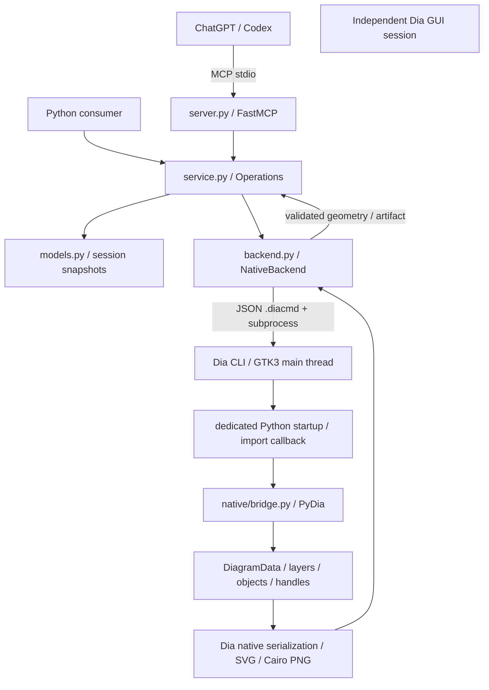
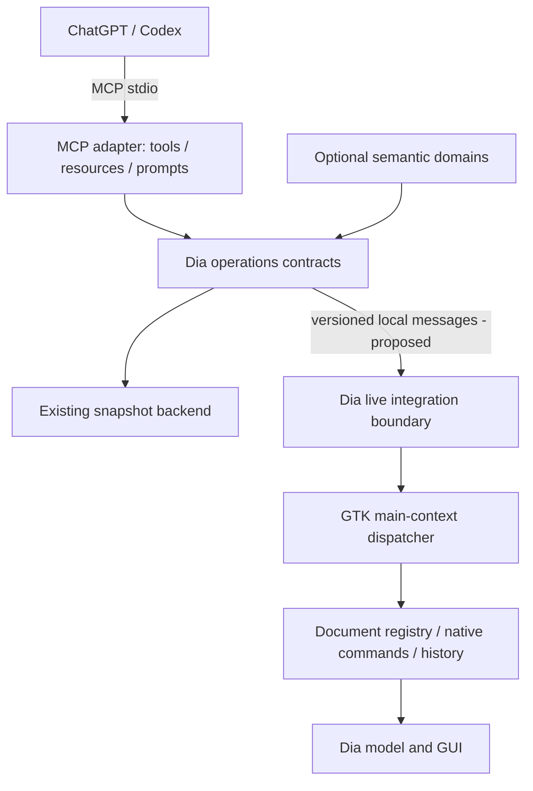

# Dia MCP architecture

Audit date: 2026-09-19. Repository baseline: `77fe10bc0`; upstream base:
`ad68cc378b7a187706bc2648c48b44d16fb80819`. Source code is authoritative.
This document separates the current implementation from the proposed live API.
See [capability inventory](mcp-capabilities.md), [tool contract](mcp-tools.md),
[development](mcp-development.md), [progress](progress.md) and
[upstream differences](upstream-differences.md).

## Current architecture, before this increment

There is **no connection to an open GUI document**. `Operations` owns an in-memory
Pydantic document; each edit clones it, validates it, and reconstructs the entire
diagram in a fresh Dia subprocess. A temporary native `.dia` export and a JSON
geometry report must succeed before revision/state are replaced. This is native
model manipulation through PyDia, not writing Dia XML by hand, IPC with a running
editor, a Python package imported into the server, or mouse automation.

The nine initial MCP tools create, inspect, connect, move, update, export and
close session diagrams. They expose 13 allowlisted node types and four connectors.
`get_capabilities` describes this contract statically; it does not probe the
installation. No resources or prompts are registered. No file-open, selection,
layer editing, delete, disconnect, group, duplicate, layout or undo tools exist.

### Upstream model and existing integration surface

| Concept | Repository evidence | Consequence for integration |
| --- | --- | --- |
| Build and GUI | `meson.build`, `app/main.c`, `app/app_procs.c` | Dia 0.98.0, GTK3, Meson, C/C++; keep the existing build and dependency locks. GTK4 is a separate plan. |
| Documents | `lib/diagramdata.h`, `app/diagram.c`, `app/dia-application.c` | `DiagramData` owns ordered layers, bounds, paper, selection and text focus; editor `Diagram` adds displays, modified state and history. An importer receives only model data. |
| Object families | `lib/object.h`, `lib/object.c`, `objects/meson.build` | Registered factories and object operations supply creation, serialization, geometry and properties. Compiled object families coexist with XML custom shapes and lines. |
| Geometry | `lib/geometry.h`, `lib/handle.h`, `lib/connectionpoint.h` | Document coordinates: x right, y down, default cm. Bounds, handles and connection points are separate concepts; GUI zoom and display scaling are irrelevant. Paper scale affects export, not requested coordinates. |
| Properties | `lib/properties.h`, `plug-ins/python/pydia-properties.c`, `pydia-property.c` | Descriptors and typed value conversion exist. PyDia exposes name/type/value/visibility/description/tooltip, but not a complete safe read/write schema or enum constraints. Visibility does not imply writability. |
| Connections | `lib/object.h`, `plug-ins/python/pydia-handle.c`, `app/load_save.c` | Handles attach to connection points; native serialization stores object references and point indices. A visual line is not automatically connected. |
| Selection/layers | `pydia-diagram.c`, `pydia-layer.c`, `pydia-diagramdata.c` | Existing wrappers expose selected objects, grouping and layer operations. They need lifetime, history and main-thread policies before remote use. |
| Undo | `app/undo.c`, `app/undo.h` | Native change stack and transaction points exist. PyDia `Object.move` discards its returned change; property setters call `dia_object_set_properties`. These calls do not automatically implement editor undo. |
| Serialization/export | `app/load_save.c`, `lib/filter.c`, renderer plug-ins | Native `.dia`, SVG and Cairo PNG are reused by MCP; the editor supports additional installed import/export filters. |
| Layout | `app/commands.c`, `app/object_ops.c`, `plug-ins/layout` | Alignment and distribution already exist. OGDF-related source is not proof of a built or available layout capability. Probe before advertising algorithms. |

### Sheets, shapes and runtime discovery

`app_init` registers plugins and built-in types, loads sheets, loads defaults,
then processes CLI imports. The embedded startup script runs while plugins are
loading: **query sheets in an import callback, not at startup-module import**.
`dia.registered_types()` and `dia.registered_sheets()` already exist upstream in
`plug-ins/python/diamodule.c`; no C discovery API needs to be invented.

`lib/sheet.c::load_all_sheets` loads user sheets and either `DIA_SHEET_PATH`
(colon-separated directories) or installed system sheets. Names are kept in the
C locale, descriptions are localized. User/system shadowing is resolved by Dia;
missing types are warned about and omitted from the sheet. The absence of an
entry from runtime discovery cannot prove that no broken source sheet exists.
`objects/custom/custom.c` recursively loads user shapes and `DIA_SHAPE_PATH` or
the installed shape directory. Environment paths replace the corresponding
system search path; include the installed directory when extending it.

A sheet is a palette, not an exclusive diagram classification. The same factory
can appear more than once, with different labels or creation data; registered
types may not occur in any sheet. `pydia-sheet.c` returns type/description/icon
triples but omits sheet-entry creation data. Do not equate a count of sheet
entries, unique factory types, or implemented semantic operations.

The existing image returned 38 sheets, 887 registered types and 891 sheet entries
under its own installation/configuration. The source contains 38 `.sheet` and
783 `.shape` files. These are a dated observation, not constants for clients.
A container's inventory does not describe the user's independently running GUI
or its custom sheets. The complete capture and membership table accompany this
audit in [mcp-capabilities.md](mcp-capabilities.md).

### Identity, transactions and concurrency

- UUID hex IDs belong to an `Operations` session and document. Object IDs survive
  movement/update and are stored as `meta.dia_mcp_id` in exported native files.
  Closing the document invalidates references. No reload/import, deletion,
  duplication, undo/redo or cross-session recovery contract exists yet. XML IDs
  such as `O0` are independent; no native pointer is sent to the client.
- `_commit` changes the logical state only after successful native rendering.
  Failure preserves the previous snapshot/revision. This is a service transaction,
  **not a Dia GUI undo transaction**; multi-call batches are not atomic.
- An `RLock` serializes service state within one server. FastMCP may invoke sync
  tools from worker threads; those threads only manipulate Python state and wait
  for a subprocess. PyDia objects exist exclusively in the CLI process and are
  used by its import callback on the main thread. There is no background mutation
  of the user's GUI. The lock does not serialize separate servers.
- Every edit recreates all nodes, labels and connectors. Full document/geometry
  responses amplify this cost. Current limits are 32 documents, 100 nodes and
  200 edges per document; these are MCP limits, not Dia limits.

### Error, security and file boundary

`DiaError` produces `{api_version, code, message}` through MCP `ToolError`;
SDK schema validation may reject arguments first. Codes currently include
`INVALID_ARGUMENT`, `NOT_FOUND`, `LIMIT_EXCEEDED`, `EMPTY_DIAGRAM`,
`ALREADY_EXISTS`, `BACKEND_UNAVAILABLE`, `BACKEND_TIMEOUT`, `BACKEND_FAILED`,
`EXPORT_FAILED` and `IO_ERROR`. The discovery increment also returns
`UNSUPPORTED_CAPABILITY` for backends without discovery. Alternative values, retryability and detailed
stale-reference errors are not yet modeled.

Local stdio exposes no shell, code evaluation or client-selected plugin path.
A trusted executable and dedicated startup directory are chosen by the server;
the embedded interpreter drops Python virtualenv path variables. Native plugins,
custom shapes, inherited Dia search paths and the configured installation remain
trusted application inputs, not an OS sandbox. Docker tasks additionally disable
networking and run as the invoking UID. Snapshot input is constrained; native
factories can still fail/crash, isolated to the subprocess with a timeout.

Export accepts a basename in one configured workspace, validates the generated
artifact, and publishes with `link` (no overwrite) or `replace` (explicit overwrite).
Preexisting symlinks are rejected. Workspace directory ownership is trusted;
it is not a defense against another process replacing that directory itself.
Do not confuse export, session close, Save, Save As and opening a user's document:
only export and session close exist today. Native-file dependency reporting is
therefore also missing. Logs use stderr; routine per-request tracing/correlation
is limited, and exception messages can contain input values. Avoid logging whole
documents when adding observability.

### Semantic coupling and implementation coupling

Desired coupling already exists in type names, properties, handles, connection
points and native export. Fragile coupling is mostly isolated in
`native/bridge.py`, but it is also visible in the public model/service:

1. `Node.properties` and tool signatures accept only `UMLClassProperties`;
   `Node.applicable_properties` rejects properties for every other family.
2. `Edge.applicable_label` restricts labels to UML; `connect_objects` assumes
   all UML connectors require two classes and special-cases indices >=8.
3. `Operations.capabilities` has a generic top-level `uml_direction` field.
4. `configure_node` knows the positional tuple layouts of UML attributes,
   methods and parameters; its fallback assumes technical shape flip/size fields.
5. Every node is assumed to have connection points; every connector factory is
   assumed to supply two endpoint handles. These are not generic Dia guarantees.
6. The default is a flowchart box; the architecture is not exclusively UML, but
   the property contract cannot represent unfamiliar families or arbitrary `.dia`.

Simply changing `NodeType` from an enum to a string would bypass these assumptions
and is unsafe. Domain tuple conversion belongs behind the integration adapter;
the generic model needs a typed property schema and optional geometry operations.

## Smallest target architecture

Keep `server.py` as the protocol adapter, `Operations` as the transport-independent
service, `NativeBackend` for isolated generation/tests, and the stdlib-only native
adapter. Preserve Meson, GTK3, locks, C fixes, native rendering/serialization,
transactional publication and working tests. Do not restructure upstream directories
or add an application-independent engineering framework.

First add read-only runtime discovery using existing PyDia. Next prototype a
narrow live boundary in the Dia process, reusing PyDia for proven read operations
and adding small app-level wrappers where command/history/lifetime access is
missing. A full stable public C ABI is not required for that prototype.

For live mode, prefer a separately restartable stdio MCP server and opt-in Unix
domain socket in a private user runtime directory. A socket reader must validate
bounded requests and enqueue them onto the GTK main context; it must never touch
native wrappers. The main thread owns registry lookups, reads and commands.
Bound the queue, define timeout/cancellation before commit, track document
revisions and reject stale preconditions. Do not hold a transport lock while
waiting for a GTK callback that needs it. Same-user connection checks and socket
permissions are part of the boundary. This is a proposal, not implemented IPC.

Alternatives: embedding FastMCP adds SDK/event-loop dependencies to Dia; exposing
raw PyDia to the server risks dangling pointers and undo bypass; repeatedly loading
files loses live edits. The current subprocess design remains valuable for batch
work and crash isolation, but cannot satisfy selection-aware editing.

### Live identity, properties and commands (proposed)

Use opaque document-session IDs, per-object registry IDs and document generations.
Invalidate IDs on close/reload; distinguish stale from unknown/wrong-document IDs.
Define deletion/undo tombstones so restored objects can recover their logical ID;
duplicates receive new IDs. Persistent metadata may assist reopening but must
handle collisions and must not expose C addresses. All lifecycle events, including
manual GUI edits, must update the registry before promising stable references.

Expose generic object/type/property/handle/connection/layer reads first. Convert
native values to bounded JSON records; represent unsupported property types
explicitly, omit unsafe setters and file-reference values until validated. Add
small native descriptor accessors only for metadata PyDia cannot safely supply
(enum alternatives, flags, constraints). Do not infer read/write permissions from
visibility or serializability. Reading arbitrary properties must not instantiate
all factories during a catalog listing.

Commands should use native change objects, transaction points, connection updates,
modified state and redraw. Define and test partial-failure rollback before batch
editing. Do not implement a parallel undo stack. Generic operations address
runtime types only after their required capabilities have been inspected. Semantic
UML, flowchart, database and network helpers then compose those primitives; visual
electrical symbols do not imply circuit simulation or engineering validation.

Alignment/distribution should wrap existing model/editor commands before adding
layout dependencies. Layout preserves native attachments and domain properties.
Optional classification returns unknown/generic/mixed or several candidate domains
with supporting type/sheet evidence, and never gates generic edits. Resources
could expose current document summary, selection and inventory; prompts could
compose explain/inspect/layout workflows. Add them with live context, not as
redundant copies of every tool.

### Versions and first increment

Existing document `api_version="1"` is the snapshot contract, not a stable native
ABI. Package metadata is 0.2.0; `__init__.__version__` still says 0.1.0 (tracked
technical debt). Dia's own version and plugin ABI are separate. A future live
handshake must advertise its integration API version and actual capabilities,
without pinning clients to a commit or versioning every semantic feature.

This increment adds `list_sheets` and `list_object_types`: fresh worker discovery,
pagination, labels/membership and an explicit marker for currently supported MCP
creation. It does not grant arbitrary factory creation, claim live access or
change the snapshot document schema. No cache is needed at this scale; the cost
is one worker invocation per query. A later persistent registry can invalidate
metadata on a catalog generation change.

## Prioritized issues and milestones

| Priority / milestone | Concrete work and acceptance condition |
| --- | --- |
| P0 / M1: discovery (this increment) | Distinguish installed from MCP-creatable types; publish runtime sheets/types without C changes. Unit, native, custom-sheet and actual stdio tests prove discovery and no document mutation. |
| P0 / M2: live reads and lifecycle | Opt-in live handshake, main-thread dispatcher, document/object registry, selection/layers/connection/geometry reads. Test manual deletion, close/reload and stale references; GUI remains responsive. |
| P0 / M3: native transactions | One move/property/connection operation through native history, with rollback, modified state and redraw. Prove GUI undo/redo and concurrency ordering before expanding mutations. |
| P1 / M4: generic properties and editing | Inspect descriptors; create/move/delete/connect unknown valid types with optional capabilities. Test UML, flowchart, ER/database, network and custom technical symbols, including zero-port objects and custom sheets. |
| P1 / M5: native documents | Open/Save/Save As/export with explicit overwrite policy, dependency reporting and preservation of unknown types/properties/layers. Test reload, copies and recovery. |
| P2 / M6: semantic domains | Extract UML conversion/validation from generic paths without changing behavior; add flowchart/database/network helpers only when useful. Each composes generic commands and has semantic fixtures. |
| P2 / M7: layout/context/observability | Existing alignment/distribution first; summaries, mixed classification, resources/prompts, request correlation and measured performance improvements. Real Wayland GUI acceptance alongside Xvfb tests. |

Highest risks are native wrapper lifetime across GUI events, bypassed native undo,
mutating off the GTK thread in a future live backend, unsafe generic property
conversion and silent data loss from rebuilding arbitrary documents with today's
limited schema. Current snapshot workers avoid the live-thread problem; do not
present a hypothetical future race as a reproduced current defect.
