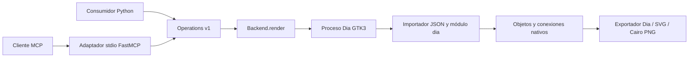

# API interna de operaciones, versión 1

Contrato implementado en [`mcp/src/dia_mcp`](../../mcp/src/dia_mcp). El esquema
JSON de un documento está en [`document.schema.json`](document.schema.json).
El contrato no contiene widgets GTK, punteros C ni objetos de CPython embebido.

## Capas

`Operations` posee los documentos de una sesión. `NativeBackend` implementa
`render(document, destination, format) -> geometry`. El adaptador MCP sólo
traduce llamadas y errores: no implementa dibujo ni reglas de geometría.
Un backend GTK4 futuro puede sustituir la materialización conservando el
contrato y las mismas pruebas. Hoy el motor continúa enlazando GTK3.

## Operaciones y resultados

| Operación | Entradas principales | Resultado |
| --- | --- | --- |
| `capabilities` / MCP `get_capabilities` | Ninguna | Versión, unidades, tipos, puertos, formatos y límites |
| `create_document` | `name` | `document` vacío con ID y revisión 0; `geometry` vacío |
| `create_object` | `document_id`, `type`, `x`, `y`, `width`, `height`, `text` | `object_id`, documento actualizado y geometría nativa |
| `connect_objects` | `document_id`, `source`, `target`, puertos, `arrow` | `connection_id`, documento y geometría nativa |
| `move_object` | `document_id`, `object_id`, `x`, `y` | Documento y geometría actualizados, mismas identidades |
| `inspect_document` | `document_id` | Copia del estado lógico y geometría; sin mutación |
| `export_diagram` | `document_id`, `filename`, `format`, `overwrite=false` | Ruta, revisión, formato, tamaño y SHA-256 |
| `close_document` | `document_id` | ID cerrado; descarta estado de sesión, conserva exportaciones |

Los IDs son UUID hexadecimales opacos. `source`/`target` deben ser nodos del mismo
documento; los IDs XML `O0`, etc., que genera Dia son independientes. La propiedad
nativa `meta.dia_mcp_id` conserva la identidad lógica en el archivo exportado,
pero el MVP no ofrece aún una operación para reimportarlo a la sesión.

Las coordenadas aceptan valores finitos entre −1000 y 1000 cm. Las dimensiones
solicitadas van de 0,1 a 100 cm; el texto, hasta 2000 caracteres XML válidos.
Los tipos admitidos son `Flowchart - Box`, `Flowchart - Ellipse` y
`Flowchart - Diamond`. No se aceptan propiedades o nombres de tipos arbitrarios.
Los límites acotan esta interfaz inicial; no son límites generales de Dia.

Los puertos son `north`, `east`, `south`, `west`, `center` o `auto`. El backend
elige el punto nativo más cercano al extremo/centro indicado, después de aplicar
el texto y resolver el tamaño. `auto` compara centros y el eje predominante,
sin prometer evitación de obstáculos. Devuelve el índice elegido y las posiciones
reales. La conexión ejecuta tanto `move_handle` como `Handle.connect`; el guardado
conserva la referencia y no solamente la apariencia de una línea.

## Transacciones, vida útil y errores

Cada edición copia el documento lógico, valida el candidato y lo materializa
en un proceso Dia nuevo mediante un importador registrado al inicio. Los
plug-ins nativos ya están cargados cuando se invoca ese importador. Las
operaciones de PyDia ocurren en el hilo principal de ese proceso.

Se guarda temporalmente un `.dia` y se verifica el código de salida, el informe
del importador y el XML. Sólo entonces cambia el estado lógico y aumenta la
revisión. Si falla la validación, importación, escritura, exportación o timeout,
la revisión y el documento anterior permanecen intactos. `create_document` sólo
crea estado lógico vacío; su primera edición comprueba el backend.

Un `RLock` serializa llamadas de un mismo servicio, también si un transporte
las despacha desde diferentes hilos. No ofrece transacciones entre varios
servidores ni undo en una ventana del editor. Los wrappers PyDia nunca cruzan
el proceso ni sobreviven a una petición.

Exportar no aumenta la revisión. Se genera y valida un archivo temporal, y se
publica atómicamente en el directorio configurado. Sin `overwrite`, un enlace
duro publica sólo si el nombre sigue libre, evitando sobrescribir una carrera.
Con `overwrite`, `os.replace` publica la versión validada. Se rechazan enlaces
simbólicos preexistentes y rutas ajenas al directorio. SVG/`.dia` se parsean;
PNG comprueba chunks/CRC y descompresión completa de filas además de dimensiones.
Si el sistema impide limpiar un temporal, se registra su ruta en stderr para
retirarlo posteriormente; ese fallo no cambia el resultado de publicación.

La API lanza `DiaError(code, message)`. MCP convierte ese error en `isError=true`
con un objeto JSON que incluye `api_version`, `code` y `message`.

| Código | Situación |
| --- | --- |
| `INVALID_ARGUMENT` | Tipo, texto, geometría, puerto, formato o basename inválido; exceso de nodos/conexiones |
| `NOT_FOUND` | Documento/objeto desconocido o extremo de otro documento |
| `LIMIT_EXCEEDED` | Máximo de documentos abiertos |
| `EMPTY_DIAGRAM` | Se intenta exportar sin nodos |
| `ALREADY_EXISTS` | Nombre ocupado o enlace simbólico de salida |
| `BACKEND_UNAVAILABLE` | Ejecutable ausente/no ejecutable |
| `BACKEND_TIMEOUT` | Dia excedió el tiempo permitido |
| `BACKEND_FAILED` | Error del importador o informe ausente/inválido |
| `EXPORT_FAILED` | Salida no cero después de importar o artefacto inválido |
| `IO_ERROR` | Fallo de archivos temporales o publicación |

La validación del esquema de herramientas MCP puede producir errores propios
del SDK antes de entrar en `Operations`; no deben confundirse con códigos
del dominio. Mensajes informativos y trazas van a stderr, nunca al stdout MCP.

## Ajustes derivados del flujo probado

1. Puertos semánticos: el cliente no necesita memorizar índices que dependen del
   tipo de figura. La geometría devuelve los índices realmente utilizados.
2. Revisión y publicación después de materializar: un fallo no consume la edición.
3. Movimiento explícito: permite verificar que las conexiones siguen al objeto,
   en vez de comprobar sólo una imagen estática.
4. Geometría de respuesta separada de dimensiones solicitadas: Dia ajusta figuras
   al texto, lo que cambia dónde deben terminar las conexiones.
5. Archivo válido además del exit code: se corrigieron dos fallos nativos de
   propagación, manteniendo comprobaciones independientes del lado Python.

## Evolución propuesta

Las ampliaciones compatibles añaden operaciones o capacidades explícitas. Cambios
de semántica, unidades o IDs requieren una versión de contrato nueva. Prioridades:
abrir/exportar snapshots para recuperar sesiones; importar `.dia` con preservación
de propiedades desconocidas; ediciones por lotes; estilos tipados; conectores
ortogonales; undo del servicio; backend persistente si las medidas justifican su
complejidad. No ampliar el MVP mediante evaluación de código recibido.
